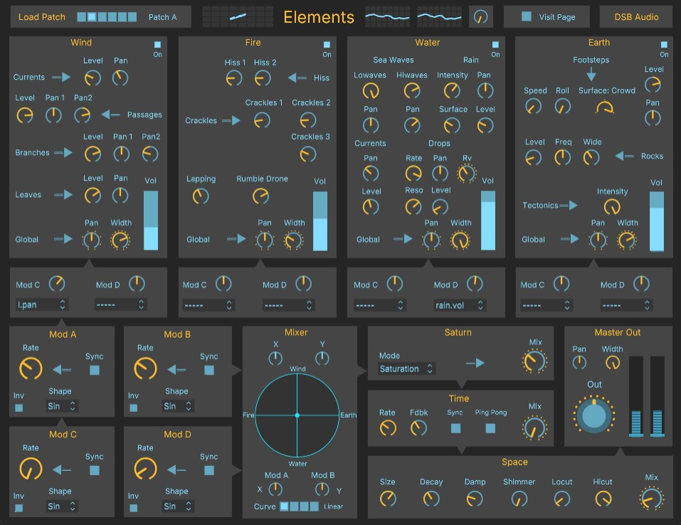

# Elements
Sound texture synthesizer based on the four elements of nature in the ancient world (water, fire, air and earth) created in plugdata for use as a VST plugin inide any DAW
# 🌿 Elements – Sound Texture Synthesizer Based on the Four Classical Elements

**Elements** is a sound texture synthesizer based on the four elements of nature in the ancient world — **water**, **fire**, **air**, and **earth** — created in **PlugData** for use as a **VST plugin inside any DAW**.

It allows users to blend and modulate elemental sonic textures in real time through an **XY pad**, generating rich, shifting, and holographic soundscapes via synthesis — no samples involved.

## 🔧 Features

- **Water** – Bubbling, fluid, and irregular textures. It flows in pulses, echoing the motion of a stream or dripping rain.  
- **Fire** – Flickering, sizzling and unstable. Rhythmic bursts evoke crackles, sparks, and the restless presence of flames.  
- **Air** – Whispering, light, and grainy. Soft patterns flutter and dissipate like wind or distant breath.  
- **Earth** – Heavy, deep, and grounded. Dense textures that feel organic, granular, and rooted in vibration.  
- **XY Vector Pad** – Real-time interpolation between the four elemental sources. The closer the cursor is to an element, the stronger its influence.  
- **Pure Synthesis** – Built entirely with oscillators, noise, filtering, and modulation inside PlugData.

## 🧰 Included Files

- `Elements~.pd` – Main patch (compatible with PlugData and Pure Data)
- `gui.png` – Interface screenshot
- `logo_elements.png` – Project logo

## 💻 Requirements

- [PlugData](https://plugdata.org/) (latest stable version recommended)  
- DAW capable of loading VST3 plugins  
- Audio interface or built-in sound system

## 🚀 How to Use

1. Open `Elements~.pd` in PlugData.  
2. If using inside a DAW, load PlugData as a **VST plugin** and open the patch.  
3. Make sure your audio system is active and routed correctly.  
4. Use your mouse to move across the **XY pad** and explore sonic combinations.  
5. Experiment with proximity and direction to modulate intensity and texture.

## 🎓 Conceptual Context

This device was developed as part of a **Master’s Final Project in Sound Art** at the University of Barcelona (2025).  
"Elements" investigates the expressive capacity of **sonic texture** through the ancient symbolic system of the four elements. It invites intuitive exploration of **textural sound** as a perceptual and conceptual experience, shaped by motion and interaction.

## 👤 Author

Developed by **[Diego DSB Audio]**  
[https://linktr.ee/HProject_music]  
2025

## 📚 Acknowledgements

Parts of the synthesis code and design concepts are inspired by the work of **Andy Farnell**, particularly his book *Designing Sound*, which provided key insights into procedural audio and sound modeling.
